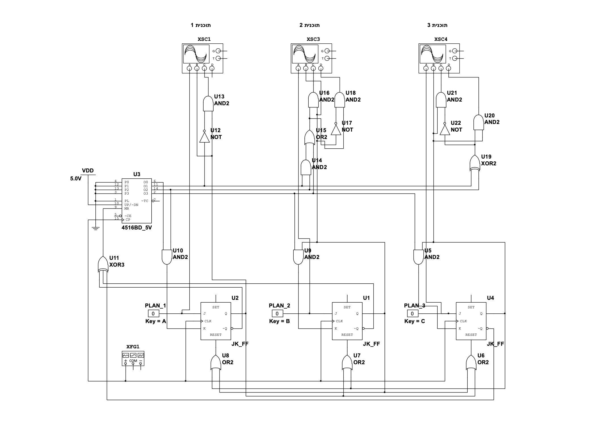
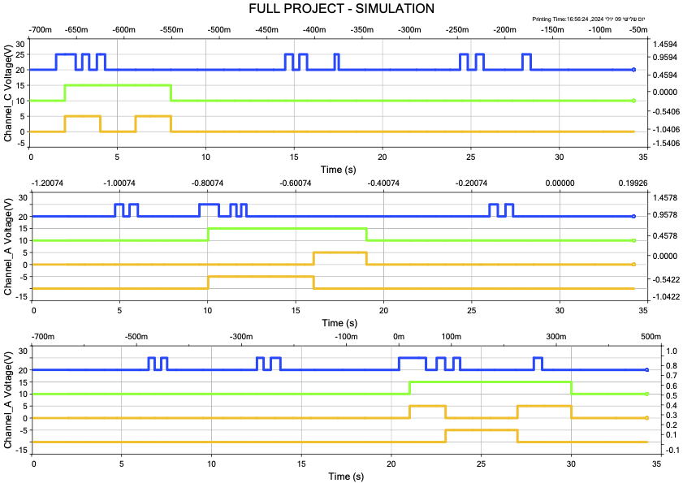

# Digital Control System for Ninja Blender Motor

## Objective
Designed and implemented a digital control system to regulate the operation time of a blender's DC motor.

## Techniques Used
- **Digital Logic Gates**: AND, OR, NOT, NAND.
- **Components**: JK flip-flops, timers, and other digital units to process and control signals.

## Simulation and Design
- Simulations and circuit design were conducted using **NI Multisim**.
- The design includes **JK flip-flops** assigned to control the pulse duration for each operation plan.
- To ensure no interference between operation plans, each JK flip-flop is reset between activations, preventing one plan from disturbing another.

## Control Mechanism
Implemented a timing-based control mechanism to:
- Automate the motor's start and stop functions based on predefined intervals.
- Synchronize the operation of the system's components for precise control.

## System Signals
- **Blue Signals**: Represent input signals to the system.
- **Green Signals**: Represent the pulse duration of each operation plan.
- **Yellow Signals**: Represent the output signals to control the blender motor.

## Skills Developed
- Digital logic design and timing control.
- Troubleshooting and problem-solving in digital systems.
- Hands-on experience with electronic components and simulation tools.

## Visuals
### Logic Level Schematic
The schematic demonstrates the use of JK flip-flops for timing control. Each flip-flop manages the pulse duration for a specific plan and includes a reset mechanism to avoid interference between plans.

### System's Signals
The signals represent different stages of the system's operation:
- **Blue (Input Signals)**: Initiate the system's control logic.
- **Green (Pulse Signals)**: Indicate the length of each plan's active duration.
- **Yellow (Output Signals)**: Control the operation of the blender motor.

### Implementation
The final implementation integrates all components, ensuring accurate control of the blender's motor operation.

